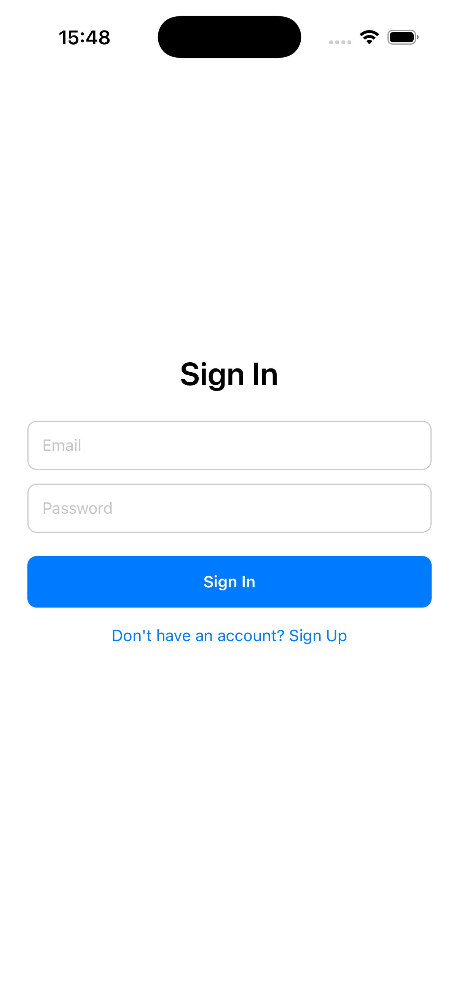
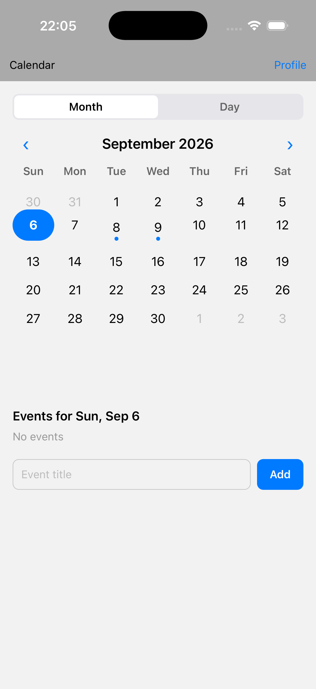

# Calendar

A bare React Native (no Expo) calendar app with Firebase email/password authentication, biometric (Face ID/Touch ID) app-lock, a hand-built month/day calendar, and event creation/editing backed by Firestore.

## Features

- Sign up / sign in with email and password (Firebase Authentication), with client-side field validation
- Biometric (Face ID/Touch ID) unlock for returning signed-in users, backed by the iOS Keychain (no password is ever stored — only a biometry-gated session flag)
- Custom-built calendar UI (no third-party calendar library) with a Month/Day view toggle
- Create and edit events for any selected day, persisted to Cloud Firestore in real time
- Profile screen (auth-gated) with sign out
- Routing via React Navigation, with a back button that only appears when not on the root screen
- Correct layout across notch / Dynamic Island / home-indicator variants via `react-native-safe-area-context`

## Tech stack

- React Native **0.87.1** (bare workflow, no Expo)
- TypeScript **~6.0**
- React **19.2**
- `@react-native-firebase/app`, `/auth`, `/firestore` **^26.4.0**
- `@react-navigation/native` + `native-stack` **^7.x**
- `react-native-keychain` **^10.0.0**
- `react-native-safe-area-context`, `react-native-screens`
- Jest + `react-test-renderer` for unit tests

## Required software versions

Verified with the following on this machine — other reasonably recent versions will likely work, but these are the exact versions this project was built and tested against:

| Tool | Version |
|---|---|
| Node.js | v24.14.0 (project requires `>= 22.11.0`, see `engines` in `package.json`) |
| npm | 11.9.0 |
| Ruby | 4.0.6 |
| CocoaPods | 1.17.0 |
| Xcode | 26.6 (Build 17F113) |
| iOS deployment target | 15.1 |

**Important:** CocoaPods requires a UTF-8 locale. If `pod install` fails with a `unicode_normalize` / encoding error, export these first:
```bash
export LANG=en_US.UTF-8
export LC_ALL=en_US.UTF-8
```

## Firebase setup

This app needs its own Firebase project (Spark/free plan is enough).

1. Create a Firebase project at [console.firebase.google.com](https://console.firebase.google.com), and register an iOS app with bundle ID `org.reactjs.native.example.calendar` (and/or an Android app with package name `com.calendar`).
2. Download `GoogleService-Info.plist` and place it at `ios/calendar/GoogleService-Info.plist` (already added to the Xcode target in this repo).
3. For Android, download `google-services.json` and place it at `android/app/google-services.json` (already present in this repo, registered for package `com.calendar`). The Google Services Gradle plugin is wired up in `android/build.gradle` / `android/app/build.gradle`. **Note:** Android has not actually been built or run — there is no Android SDK on the machine this was developed on, only iOS has been verified end-to-end.
4. In **Authentication → Sign-in method**, enable **Email/Password**.
5. In **Build → Firestore Database**, click **Create database** (production mode is fine — a database does not exist by default, and the app will fail with a "database does not exist" error until this step is done).
6. In Firestore's **Rules** tab, publish:
   ```
   rules_version = '2';
   service cloud.firestore {
     match /databases/{database}/documents {
       match /events/{eventId} {
         allow read, update, delete: if request.auth != null && request.auth.uid == resource.data.uid;
         allow create: if request.auth != null && request.auth.uid == request.resource.data.uid;
       }
     }
   }
   ```

## Getting started

Install JS dependencies:
```bash
npm install
```

### iOS

```bash
cd ios
export LANG=en_US.UTF-8
export LC_ALL=en_US.UTF-8
USE_FRAMEWORKS=static pod install
cd ..
npm run ios
```

### Android

`google-services.json` and the Gradle plugin wiring are already in place (see Firebase setup step 3 above), but this has not been built or run — requires an installed Android SDK/emulator to verify.
```bash
npm run android
```

## Testing biometric unlock

Face ID needs to be enrolled in the iOS Simulator first: **Simulator menu → Features → Face ID → Enrolled**. Then sign in once (this establishes the biometric session), background and re-open the app, and approve via **Simulator menu → Features → Face ID → Matching Face**.

## Running tests

```bash
npm test
```

Runs the Jest unit test suite (calendar date math, auth field validation, the Firestore events hook, and the biometric gate hook — Firebase and Keychain native modules are mocked under `__mocks__/`).

## Project structure

```
App.tsx                          # auth gate → biometric gate → navigation root
components/
  auth/                          # sign in/up screen, validation, biometric session helpers
  navigation/                    # Header, NavBar, route types, header navigation hook
  dashboard/                     # Calendar screen + CalendarGrid / DayView / EventList / EventForm
  profile/                       # Profile screen (sign out)
```

## Screenshots

| Sign in | Calendar — Month | Calendar — Day |
|---|---|---|
|  |  |  |
